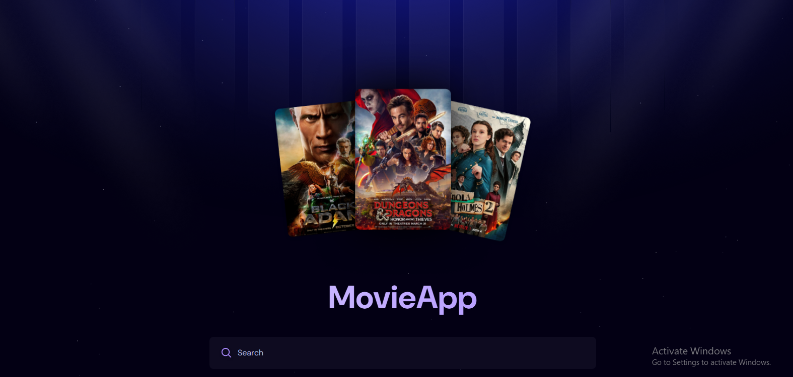
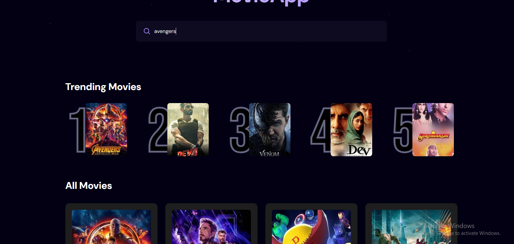

# MovieApp 🎬

A simple and responsive movie search application built with React, using The Movie Database (TMDb) API to fetch and display movies. The app allows users to search for movies, view movie details, and get a glimpse of trailers on hover.

## Features ✨

- **Search for Movies**: Search for movies by name using the search bar.
- **Trending Movies**: View the most popular movies based on search count.
- **Movie Details**: See movie titles, posters, ratings, and short descriptions.
- **Trailer Preview**: Hover over a movie to get a quick trailer preview.
- **Responsive Design**: Works well on both desktop and mobile devices.
- **Loading Spinner**: A sleek loader while the data is being fetched.

## Tech Stack ⚙️

- **React**: Frontend framework to build the app.
- **Appwrite**: Backend service to store search data and manage trends.
- **TMDb API**: Fetch movie data, including posters, ratings, descriptions, and trailers.
- **CSS (TailwindCSS)**: For styling and responsive layout.

## Installation 📦

1. Clone the repository:
   ```bash
   git clone https://github.com/yourusername/movieapp.git
   cd movieapp
   
2. Install dependencies:
   ```bash
   npm install

3. Create a .env file in the root of the project and add your API key for TMDb:

   ```bash

      VITE_TMDB_API_KEY=your_tmdb_api_key
      VITE_APPWRITE_PROJECT_ID=your_appwrite_project_id
      VITE_APPWRITE_DATABASE_ID=your_appwrite_database_id
      VITE_APPWRITE_COLLECTION_ID=your_appwrite_collection_id
4. Run the app:
   ```bash
     npm run dev
5. Open http://localhost:3000 in your browser.

## API Integration 📡

This app uses the **TMDb API** to fetch movie data. It also uses **Appwrite** for tracking search frequency and managing trending movies.

- **Search Movies:** Uses `/search/movie` API endpoint from TMDb.
- **Trending Movies:** Managed by Appwrite's database with search counts.

---

## Future Improvements 🔮

- Add user authentication (sign up / login)
- Allow users to save favorite movies
- Implement pagination for movie results
- Add more filters (genre, year, etc.) to search

---

## Contributing 🤝

Feel free to fork the repository and submit pull requests. If you encounter bugs or have suggestions, create an issue on GitHub.

### Steps to contribute:

1. Fork the repository.
2. Create a new branch for your feature:
   
   ```bash
   git checkout -b feature-name
   
3. Commit your changes:

   ```bash
      git commit -m "Add feature"
   
4. Push to the branch:

   ```bash
    git push origin feature-name
   
5. Create a pull request.

## Screenshots 📸

### Home Page


### Search Results



---

## License 📜

MIT License

Copyright (c) 2025 Ashutosh

Permission is hereby granted, free of charge, to any person obtaining a copy  
of this software and associated documentation files (the "Software"), to deal  
in the Software without restriction, including without limitation the rights  
to use, copy, modify, merge, publish, distribute, sublicense, and/or sell  
copies of the Software, and to permit persons to whom the Software is  
furnished to do so, subject to the following conditions:

The above copyright notice and this permission notice shall be included in all  
copies or substantial portions of the Software.

THE SOFTWARE IS PROVIDED "AS IS", WITHOUT WARRANTY OF ANY KIND, EXPRESS OR  
IMPLIED, INCLUDING BUT NOT LIMITED TO THE WARRANTIES OF MERCHANTABILITY,  
FITNESS FOR A PARTICULAR PURPOSE AND NONINFRINGEMENT. IN NO EVENT SHALL THE  
AUTHORS OR COPYRIGHT HOLDERS BE LIABLE FOR ANY CLAIM, DAMAGES OR OTHER  
LIABILITY, WHETHER IN AN ACTION OF CONTRACT, TORT OR OTHERWISE, ARISING FROM,  
OUT OF OR IN CONNECTION WITH THE SOFTWARE OR THE USE OR OTHER DEALINGS IN THE  
SOFTWARE.
